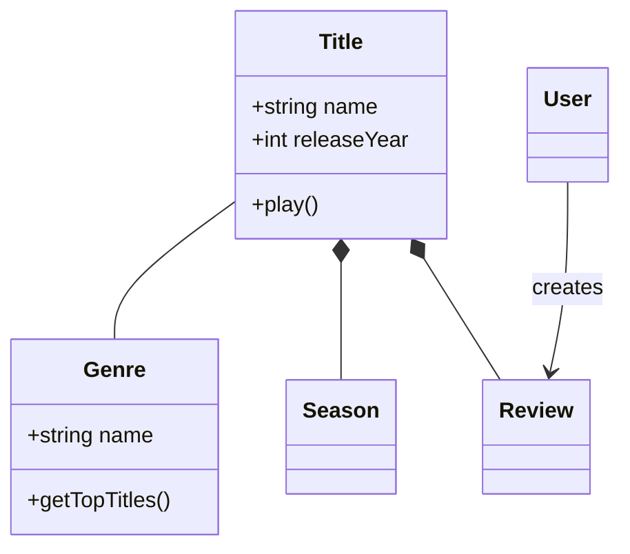
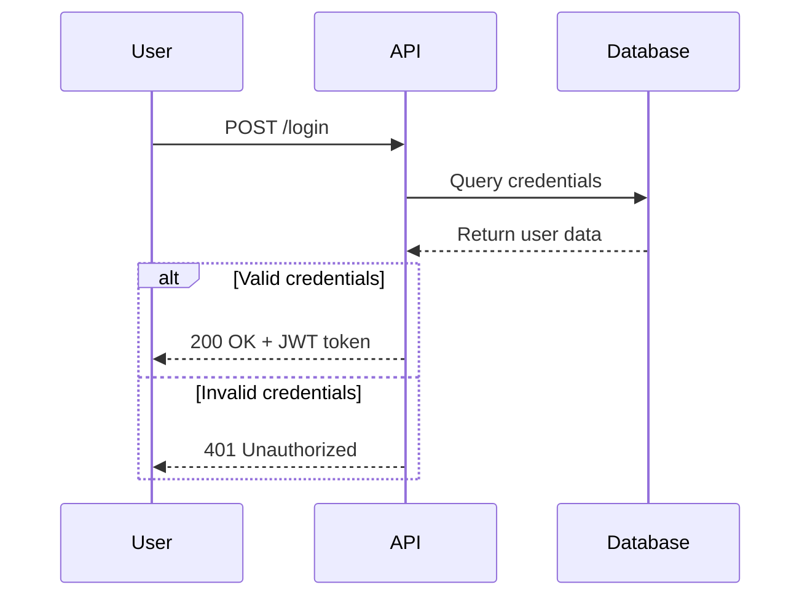
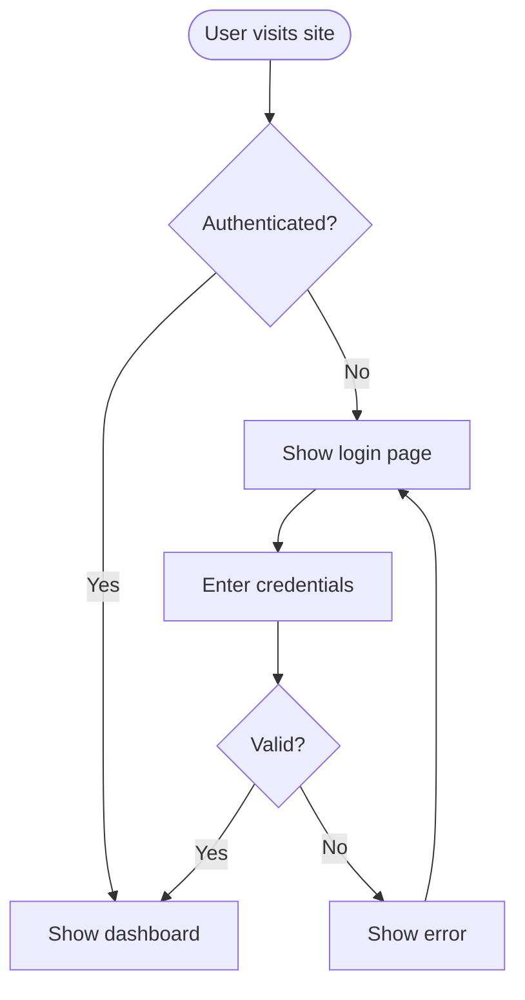
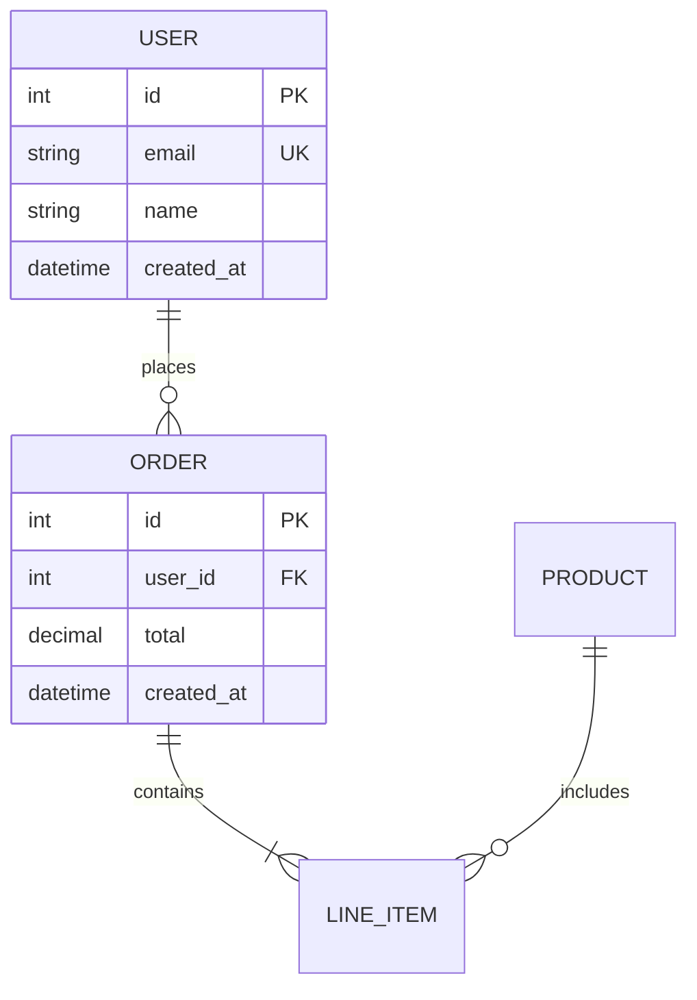
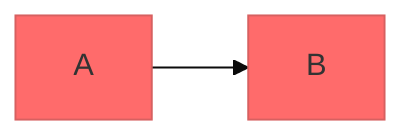

# Mermaid Diagramming

Create professional software diagrams using Mermaid's text-based syntax. Mermaid renders diagrams from simple text definitions, making diagrams version-controllable, easy to update, and maintainable alongside code.

## Core Syntax Structure

All Mermaid diagrams follow this pattern:

```mermaid
diagramType
  definition content
```

**Key principles:**
- First line declares diagram type (e.g., `classDiagram`, `sequenceDiagram`, `flowchart`)
- Use `%%` for comments
- Line breaks and indentation improve readability but aren't required
- Unknown words break diagrams; parameters fail silently

## Rendering Targets & Compatibility — avoid silent blank diagrams

**Read this before authoring diagrams that will be viewed in VS Code or any embedded renderer.**

Mermaid **fails silently**: an unsupported construct produces a *blank* diagram (or a brief flash that disappears), never an inline error message. The renderer that will actually display the diagram — not the spec, not a newer CLI — is the authority. A diagram that renders in `mmdc` (CLI) can still blank in an editor whose bundled mermaid is older.

### VS Code (`bierner.markdown-mermaid`) — the usual target here
- Bundles a **pinned, lagging** mermaid version (check `~/.vscode/extensions/bierner.markdown-mermaid-*/`, e.g. 11.12.x). It rejects constructs a newer CLI (e.g. 11.15) accepts. Verify against the *target's* version, or treat the safe subset below as the floor.
- **It applies mermaid's *light* ("default") theme even on a dark editor color theme.** Symptom: dark-grey text and lavender (`#ECECFF`) participant boxes on a dark background → "faint / hard to read." This is a *contrast* problem, not a font-size problem.
- **Do NOT fix contrast with per-diagram theming — both mechanisms backfire in this extension:**
  - YAML frontmatter (` ```mermaid` then `---\nconfig:\n  theme: dark\n---`) → the extension mishandles the embedded `---` → diagram **flashes then hides**.
  - `%%{init: {"theme":"dark"}}%%` directive → collides with the extension's own theme re-init on scroll/focus/save/theme-sync → **intermittent blank** ("worked a second ago, now gone").
  - A frontmatter `background:#ffffff` does nothing — VS Code forces the editor background behind the transparent SVG.
- **Fix contrast globally, once, in `settings.json`** (the extension applies it in a single init → nothing to race):
  ```json
  "markdown-mermaid.darkModeTheme": "dark",
  "markdown-mermaid.lightModeTheme": "dark"
  ```
  Keep the diagrams themselves **plain** (no frontmatter, no init directive). Reload the VS Code window for the setting to take effect.

### Safe subset — constructs that silently blank an (embedded/older) renderer
- **Subgraph as an edge endpoint** — `A -.-> SUBGRAPH_ID`. Point edges only at nodes; to show "X replaces Y", draw the edge between two nodes and label it.
- **Quoted pipe edge-labels with parens/Unicode** — `A -->|"fetch(x) → y"| B`. Use plain unquoted labels: `A -->|fetch bytes| B`.
- **Literal `{ }` braces in node text** — `["/file/{id}"]`. Rephrase without braces.
- **Emoji & non-ASCII glyphs** in labels/aliases/comments — `⭐ ⟳ ❌ → · …` and box-drawing chars (`─────`). Use ASCII (`-`, an `OUR TEAM` label, `see bug X`).
- **Sequence `participant … as` aliases** containing `<br/>`, parens, or slashes — `participant M as Facade<br/>(GemBox/Aspose)`. Keep aliases plain words + spaces; put detail in notes/other nodes.
- **`<br/>` or extra `:` inside sequence message text** — `A->>B: store (x)<br/>y`. Use ` - ` / commas: `A->>B: store x - y`.

`<br/>`, parens, and slashes are fine inside **quoted flowchart node labels** (`["a/b (c)<br/>d"]`) — the breakage above is specific to comments, edge labels, and sequence participant aliases.

### Verify before claiming done — render and LOOK
SVG node counts do not reveal contrast or truncation. Reproduce the target and view the result:
- Render every block in a markdown file with a pass/fail per chart: `mmdc -i doc.md -o out.md` (emits `out-1.svg`, `out-2.svg`, … each flagged ✅/❌).
- For contrast/legibility, render to **PNG on a dark canvas and actually open/Read it**: `mmdc -i d.mmd -o d.png -b "#1e1e1e" -s 2`.
- Windows + system Chrome (avoids a Chromium download): `pptr.json` = `{ "executablePath": "C:/Program Files/Google/Chrome/Application/chrome.exe", "args": ["--no-sandbox"] }`; install with `PUPPETEER_SKIP_DOWNLOAD=true npm i @mermaid-js/mermaid-cli`; run `mmdc … -p pptr.json`.

### Styling that reads on any background
- `classDef` light fills + explicit dark text (`fill:#d4f7d4,color:#1b5e20`) read fine on light *or* dark — flowchart nodes are safe without any theme.
- Only **unboxed text** (sequence message labels, flowchart edge labels) depends on the renderer's theme — which is exactly why the global dark-theme setting, not per-diagram config, is the real fix for dark editors.

## Diagram Type Selection Guide

**Choose the right diagram type:**

1. **Class Diagrams** - Domain modeling, OOP design, entity relationships
   - Domain-driven design documentation
   - Object-oriented class structures
   - Entity relationships and dependencies

2. **Sequence Diagrams** - Temporal interactions, message flows
   - API request/response flows
   - User authentication flows
   - System component interactions
   - Method call sequences

3. **Flowcharts** - Processes, algorithms, decision trees
   - User journeys and workflows
   - Business processes
   - Algorithm logic
   - Deployment pipelines

4. **Entity Relationship Diagrams (ERD)** - Database schemas
   - Table relationships
   - Data modeling
   - Schema design

5. **C4 Diagrams** - Software architecture at multiple levels
   - System Context (systems and users)
   - Container (applications, databases, services)
   - Component (internal structure)
   - Code (class/interface level)

6. **State Diagrams** - State machines, lifecycle states
7. **Git Graphs** - Version control branching strategies
8. **Gantt Charts** - Project timelines, scheduling
9. **Pie/Bar Charts** - Data visualization

## Quick Start Examples

### Class Diagram (Domain Model)


### Sequence Diagram (API Flow)


### Flowchart (User Journey)


### ERD (Database Schema)


## Detailed References

For in-depth guidance on specific diagram types, see:

- **[references/class-diagrams.md](references/class-diagrams.md)** - Domain modeling, relationships (association, composition, aggregation, inheritance), multiplicity, methods/properties
- **[references/sequence-diagrams.md](references/sequence-diagrams.md)** - Actors, participants, messages (sync/async), activations, loops, alt/opt/par blocks, notes
- **[references/flowcharts.md](references/flowcharts.md)** - Node shapes, connections, decision logic, subgraphs, styling
- **[references/erd-diagrams.md](references/erd-diagrams.md)** - Entities, relationships, cardinality, keys, attributes
- **[references/c4-diagrams.md](references/c4-diagrams.md)** - System context, container, component diagrams, boundaries
- **[references/architecture-diagrams.md](references/architecture-diagrams.md)** - Cloud services, infrastructure, CI/CD deployments
- **[references/advanced-features.md](references/advanced-features.md)** - Themes, styling, configuration, layout options

## Best Practices

1. **Start Simple** - Begin with core entities/components, add details incrementally
2. **Use Meaningful Names** - Clear labels make diagrams self-documenting
3. **Comment Extensively** - Use `%%` comments to explain complex relationships
4. **Keep Focused** - One diagram per concept; split large diagrams into multiple focused views
5. **Version Control** - Store `.mmd` files alongside code for easy updates
6. **Add Context** - Include titles and notes to explain diagram purpose
7. **Iterate** - Refine diagrams as understanding evolves
8. **Prefer tall over wide** - Vertical diagrams read far better in docs/previews than ones that sprawl
   horizontally (forcing horizontal scrolling and shrinking text to fit). Pick the orientation by shape:
   - **Simple/linear flows:** `flowchart TD` is already tall — use it (not `LR`).
   - **Layered diagrams (several groups, many nodes per group):** `TD` makes each layer a *wide
     horizontal band* — the whole thing ends up very wide (e.g. a 4-layer/17-node diagram measured
     **4.5:1**). Counterintuitively, set the **top level to `flowchart LR`** *and* `direction TB` on each
     subgraph: the layers become side-by-side **vertical columns**, flipping the same diagram to **0.68:1**
     (taller than wide). Note `direction TB` alone does *not* fix a `TD` layered diagram — cross-layer
     edges override the subgraph direction and re-spread the nodes horizontally.
   - **Verify, don't guess:** read the exported SVG's `width`/`height` (or render a PNG and check pixel
     dims). Treat W/H > ~1.7 as too wide and re-orient.
   - *Exception:* sequence diagrams are inherently horizontal (one lane per participant) — there's no
     orientation flag; keep them readable by limiting participants and combining lanes.
9. **Color sequence diagrams explicitly** - Sequence diagrams have no `classDef`, so under a dark theme
   they render monochrome and hard to scan. Colorize via `themeVariables` (`actorBkg`, `labelBoxBkgColor`
   for alt/opt tabs, `loopTextColor` for the `[condition]` labels, `noteBkgColor`). Flowcharts instead
   get their color from per-node `classDef`.
10. **Minimize crossing and long arrows** - On any non-trivial flowchart, the default `dagre` engine
    draws long diagonal splines that cross each other and sweep across the whole diagram (especially
    "back" edges that point against the main flow, and edges into a hub node that many others depend on).
    Two levers, in order of payoff:
    - **Switch to `layout: elk` first** — it's the single highest-leverage fix. elk routes edges
      orthogonally down shared channels and packs ranks tighter, so the same source turns a tangle of
      crossing diagonals into clean right-angle runs (verified: it cleaned up every dense flowchart in
      this repo without worsening aspect ratio, and even stacked disjoint clusters vertically → taller).
      It's deterministic — no declaration-order guessing. Bake it into the pre-render config (below).
    - **Then tidy declaration order** (helps both engines, but mostly a `dagre` concern): declare sibling
      nodes left-to-right in the order you want them, and declare each node's out-edges grouped by source
      in target order. This seeds the layout's crossing-minimization with a good initial ordering.
    - **Verify by rendering and looking** (per the section above) — crossing count isn't visible in the
      source. If arrows still sweep far or cross after elk, the graph is likely *semantically* tangled
      (a node wired to everything); consider splitting it or dropping secondary annotation edges.

## Configuration and Theming

Mermaid supports a frontmatter config block:



**Available themes:** default, forest, dark, neutral, base

> ⚠️ **Do NOT use this frontmatter (or `%%{init}%%`) to theme diagrams targeting the VS Code
> `bierner.markdown-mermaid` extension** — both trigger the flash-then-hide / intermittent-blank
> failures described under *Rendering Targets & Compatibility*. For that target, theme globally via
> `settings.json` if live rendering is acceptable, or **pre-render to committed SVGs** (below) for a
> guaranteed-stable result. Frontmatter/init theming is fine for CLI rendering and GitHub.

**Layout options:**
- `layout: dagre` (default) - Classic balanced layout; routes edges as diagonal splines, which tangle on
  dense graphs (many long, crossing arrows).
- `layout: elk` - **Prefer this for any flowchart with more than a handful of edges** (bundled in
  mermaid-cli 11.x and the recent VS Code extension — no extra install). It routes edges **orthogonally**
  (right-angles along shared channels) and packs nodes tighter, which dramatically cuts crossing and
  shortens arrows. See best-practice #10.

**Look options:**
- `look: classic` - Traditional Mermaid style
- `look: handDrawn` - Sketch-like appearance

## Exporting and Rendering

**Native support in:**
- GitHub/GitLab - Automatically renders in Markdown
- VS Code - With Markdown Mermaid extension
- Notion, Obsidian, Confluence - Built-in support

**Export options:**
- [Mermaid Live Editor](https://mermaid.live) - Online editor with PNG/SVG export
- Mermaid CLI - `npm install -g @mermaid-js/mermaid-cli` then `mmdc -i input.mmd -o output.png`
- Docker - `docker run --rm -v $(pwd):/data minlag/mermaid-cli -i /data/input.mmd -o /data/output.png`

### Pre-rendered SVG convention (the "once and for all" fix for flaky live renderers)

When the target renderer is unreliable (the VS Code extension flashing/blanking, or to guarantee a doc
renders identically on GitHub, ADO wiki, and offline), **stop depending on live rendering**: commit a
pre-rendered SVG per diagram and embed it as an image, keeping the Mermaid as the single source of truth.

Per diagram block in the doc:
```markdown


<details>
<summary>Mermaid source — edit here, then regenerate diagrams/system-1.svg</summary>

​```mermaid
flowchart TD
  A --> B
​```

</details>
```
- The **image** is the stable, always-readable view (theme baked in at render time → never faint, never
  flashes, version-independent). The `<details>` keeps the editable source in-file for diffs/PRs.
- Render with a dark theme + baked background so the SVG is self-contained on any viewer:
  `mmdc -i block.mmd -o diagrams/system-N.svg -c cfg.json -b "#1e1e1e" -s 2`.
  - **Font / clipping:** use `fontSize` ~`20px` and set `useMaxWidth:false` plus padding so edges aren't
    clipped — flowchart `cfg.json`: `{"theme":"dark","layout":"elk","themeVariables":{"fontSize":"20px"},
    "flowchart":{"useMaxWidth":false,"htmlLabels":true,"diagramPadding":18,"nodeSpacing":55,"rankSpacing":65}}`.
    The `"layout":"elk"` is what keeps arrows short and non-crossing (best-practice #10); omit it only for
    sequence diagrams (elk is flowchart-only — the sequence config stays on the default engine).
  - **Sequence color:** add the sequence `themeVariables` from best-practice #9 (`actorBkg`,
    `labelBoxBkgColor`, `loopTextColor`, `noteBkgColor`, …) and `"sequence":{"useMaxWidth":false,
    "diagramMarginX":24,"diagramMarginY":16,"boxMargin":12}`.
  - `-s 2` renders at 2× for crisp text; a taller (not wider) layout also yields larger apparent text
    since the viewer shrinks wide diagrams to fit.
- Ship a **regen script** next to the docs that extracts each ```mermaid block in order and re-renders
  `diagrams/system-<N>.svg`, so editing the source + running the script keeps images in sync.

**Windows/PowerShell gotchas when scripting `mmdc`:**
- Point Puppeteer at the system browser via a `-p pptr.json` (`{"executablePath":"…/chrome.exe",
  "args":["--no-sandbox"]}`) and install with `PUPPETEER_SKIP_DOWNLOAD=true` to skip the Chromium download.
- **Write the `mmdc` config/pptr JSON BOM-less.** `Set-Content -Encoding utf8` in Windows PowerShell 5.1
  prepends a UTF-8 BOM that breaks mermaid-cli's `JSON.parse` ("Unexpected token ''"). Use
  `[System.IO.File]::WriteAllText($path, $json)` (no BOM) instead.

## Common Pitfalls

- **Breaking characters** - Avoid `{}` in comments, use proper escape sequences for special characters
- **Syntax errors** - Misspellings break diagrams; validate syntax in Mermaid Live
- **Overcomplexity** - Split complex diagrams into multiple focused views
- **Missing relationships** - Document all important connections between entities

## When to Create Diagrams

**Always diagram when:**
- Starting new projects or features
- Documenting complex systems
- Explaining architecture decisions
- Designing database schemas
- Planning refactoring efforts
- Onboarding new team members

**Use diagrams to:**
- Align stakeholders on technical decisions
- Document domain models collaboratively
- Visualize data flows and system interactions
- Plan before coding
- Create living documentation that evolves with code
