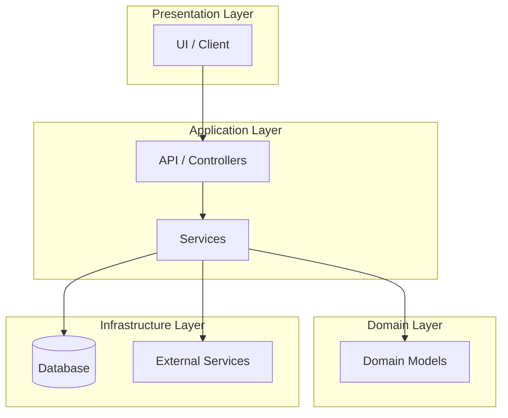
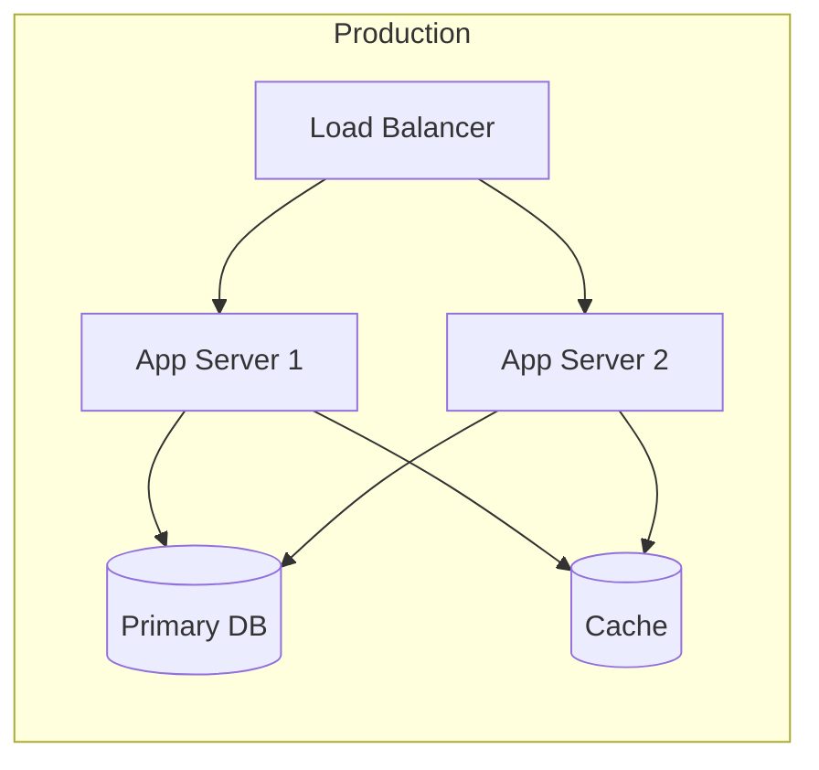

# {PROJECT_NAME} - Technical Specification

## Architecture Overview



## Tech Stack

| Layer | Technology | Version |
|-------|------------|---------|
| Language | {TECH_STACK} | {VERSION} |
| Framework | [Framework] | [Version] |
| Testing | {TEST_FRAMEWORK} | [Version] |
| Database | [Database] | [Version] |
| Build Tool | [Tool] | [Version] |

## Data Schemas

### [Primary Entity]

```{SCHEMA_LANGUAGE}
// Define your primary data model here
// Use TypeScript interfaces, C# classes, or Python dataclasses

interface Example {
  id: string;
  name: string;
  createdAt: Date;
  updatedAt: Date;
}
```

### [Secondary Entity]

```{SCHEMA_LANGUAGE}
// Additional entity definitions
```

## API Contracts

### [Endpoint Group Name]

#### GET /api/v1/resource

**Description:** Retrieve resource(s)

**Request:**
```json
// Query parameters or request body
{
  "filter": "optional"
}
```

**Response (200):**
```json
{
  "data": [],
  "pagination": {
    "page": 1,
    "limit": 20,
    "total": 100
  }
}
```

**Response (4xx/5xx):**
```json
{
  "error": {
    "code": "ERROR_CODE",
    "message": "Human-readable message"
  }
}
```

#### POST /api/v1/resource

**Description:** Create resource

**Request:**
```json
{
  "name": "required"
}
```

**Response (201):**
```json
{
  "data": {
    "id": "generated-id"
  }
}
```

## Component Breakdown

| Component | Responsibility | Dependencies |
|-----------|----------------|--------------|
| [Component 1] | [What it does] | [What it needs] |
| [Component 2] | [What it does] | [What it needs] |
| [Component 3] | [What it does] | [What it needs] |

## Error Handling Strategy

### Error Categories
1. **Validation Errors (4xx):** Return structured error with field-level details
2. **Business Errors (4xx):** Return error code + user-friendly message
3. **System Errors (5xx):** Log details, return generic message to user

### Error Response Format
```json
{
  "error": {
    "code": "VALIDATION_FAILED",
    "message": "The request could not be processed",
    "details": [
      { "field": "email", "message": "Invalid email format" }
    ]
  }
}
```

## Testing Strategy

### Unit Tests
- **Coverage Target:** {COVERAGE_TARGET}%
- **Focus:** Business logic, validation, edge cases
- **Pattern:** AAA (Arrange, Act, Assert)

### Integration Tests
- **Scope:** API endpoints, database operations
- **Approach:** In-memory database or test containers

### E2E Tests
- **Framework:** {TEST_FRAMEWORK}
- **Scope:** Critical user flows only
- **Environment:** Staging mirror

## Security Considerations

- [ ] Authentication: [JWT / Session / OAuth]
- [ ] Authorization: [RBAC / ABAC]
- [ ] Input validation: All external input sanitized
- [ ] Secrets management: Environment variables, not hardcoded
- [ ] HTTPS only in production

## Performance Budgets

| Metric | Target |
|--------|--------|
| API Response (p95) | < 200ms |
| Page Load (LCP) | < 2.5s |
| Bundle Size | < 200KB gzipped |
| Database Query | < 50ms |

## Deployment Architecture



## Open Technical Decisions

<!-- Track unresolved technical choices -->

- [ ] Decision 1: [Options being considered]
- [ ] Decision 2: [Options being considered]

---

**Last Updated:** {DATE}
**Status:** Draft | In Review | Approved
